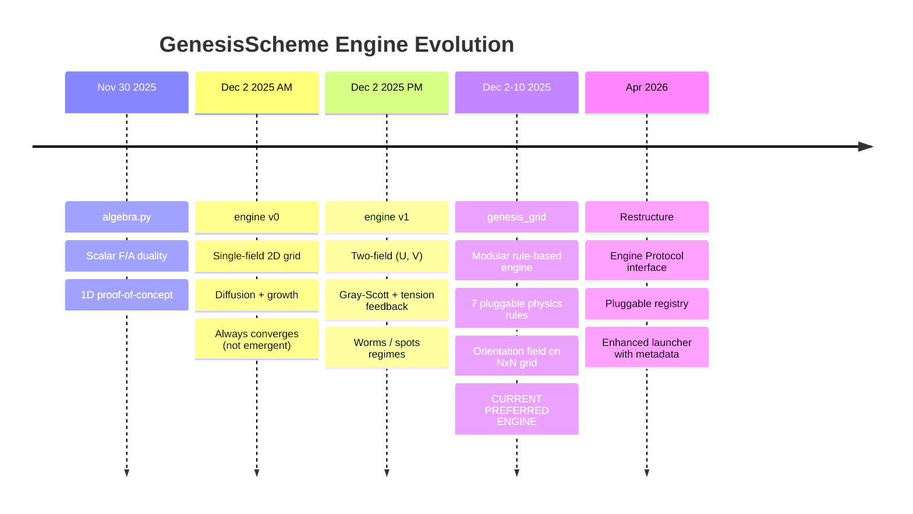
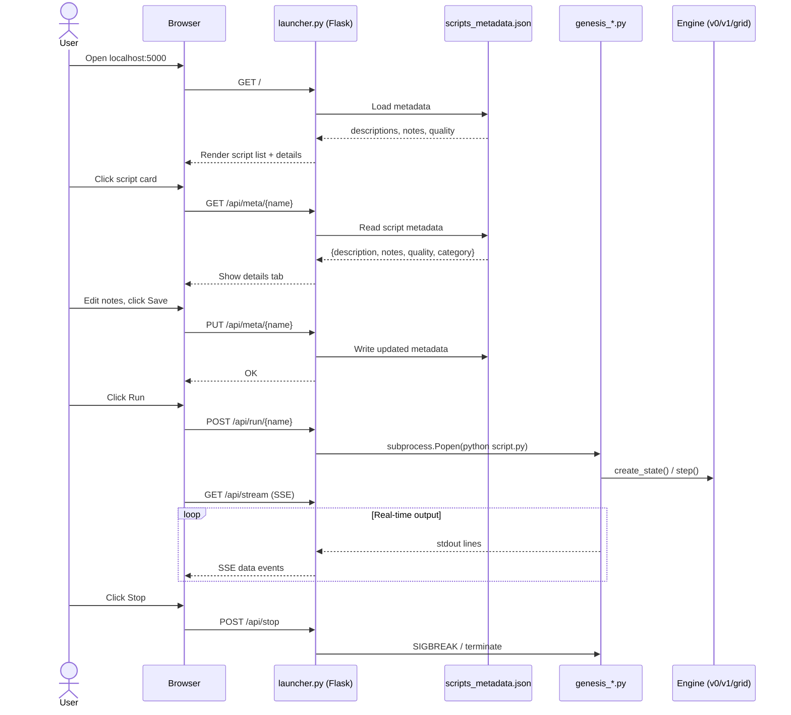

# GenesisScheme Architecture

```mermaid
graph TB
    %% ===== LAUNCHER =====
    subgraph LAUNCHER["Launcher  (localhost:5000)"]
        direction LR
        L_APP["launcher.py<br/><i>Flask web app</i>"]
        L_META[("scripts_metadata.json<br/><i>descriptions, notes,<br/>quality, categories</i>")]
        L_APP <--> L_META
    end

    %% ===== TOP-LEVEL SCRIPTS =====
    subgraph SCRIPTS["Top-Level Scripts  (18 runnable .py files)"]
        direction TB

        subgraph S_ANIM["Animations"]
            animate_2d["animate_2d.py"]
            animate_field["animate_field.py"]
            animate_gray_scott["animate_gray_scott.py"]
        end

        subgraph S_FIELD["Field Visualizations"]
            fields_pretty["genesis_fields_pretty.py"]
            fields_pretty_2["genesis_fields_pretty_2.py"]
            fields_pretty_lite["genesis_fields_pretty_lite.py"]
            grid_folds["genesis_grid_fields_folds.py"]
        end

        subgraph S_QUIVER["Quiver / Particles"]
            coupling["coupling_quiver_grid.py"]
            arrow_large["genesis_arrow_field_large.py"]
            qp["genesis_quiver_particles.py"]
            qp_phase["genesis_quiver_particles_phase.py"]
            qpf["genesis_quiver_phase_field.py"]
            qpg_nt["genesis_quiver_phase_grid_notriad.py"]
            simple_emerge["genesis_simple_quiver_..._emergence.py"]
            simple_qp["genesis_simply_quiver_particles.py"]
        end

        subgraph S_DEMO["Demos"]
            scalar_demo["main_scalar_demo.py"]
            cupy_test["cupy-test.py"]
            vispy_ex["vispy_heatmap_example.py"]
        end
    end

    %% ===== ENGINE INTERFACE =====
    subgraph INTERFACE["Engine Interface  (src/genesis_scheme)"]
        direction TB
        PROTO["engine_interface.py<br/><b>GenesisEngine Protocol</b><br/><i>name, description, created<br/>create_state(), step()</i>"]
        REG["engine_registry.py<br/><i>register(), get(), list_engines()</i>"]
        PROTO --- REG
    end

    %% ===== ALGEBRA FOUNDATIONS =====
    subgraph ALGEBRA["Algebra Foundations  (src/genesis_scheme)"]
        direction LR
        alg["algebra.py<br/><i>UnityState, F/A duality, step()</i>"]
        alg2d["algebra_2d.py<br/><i>UnityState2D, 2D rotation</i>"]
        fu["field_unity.py<br/><i>FieldUnity, diffusion/reaction</i>"]
        gs["gray_scott.py<br/><i>GrayScottState, reaction-diffusion</i>"]
    end

    %% ===== ENGINE V0 =====
    subgraph EV0["Engine v0  (src/genesis_scheme/engine)"]
        direction TB
        ev0_base["genesis_base_engine.py<br/><i>Field, D-/D+/N, step()</i>"]
        ev0_adapt["adapter.py → EngineV0"]
        ev0_base --> ev0_adapt
    end

    %% ===== ENGINE V1 =====
    subgraph EV1["Engine v1  (src/genesis_scheme/engine_v1)"]
        direction TB
        ev1_field["field2.py<br/><i>Field2(U, V)</i>"]
        ev1_ops["ops.py<br/><i>D-, D+, step()</i>"]
        ev1_gs["ops_grayscott.py<br/><i>step_gs, step_gs_genesis</i>"]
        ev1_gen["ops_genesis.py<br/><i>step_genesis (tension feedback)</i>"]
        ev1_tension["tension.py<br/><i>tension_norm()</i>"]
        ev1_log["genesis_logging.py / genesis_signature.py"]
        ev1_adapt["adapter.py → EngineV1"]
        ev1_field --> ev1_ops
        ev1_field --> ev1_gs
        ev1_field --> ev1_gen
        ev1_field --> ev1_tension
        ev1_ops --> ev1_adapt
        ev1_gen --> ev1_adapt
    end

    %% ===== GENESIS GRID =====
    subgraph GRID["Genesis Grid  (src/genesis_grid)  — LATEST ENGINE"]
        direction TB

        subgraph GRID_CORE["Core"]
            g_backend["backend.py<br/><i>NumPy / CuPy switch</i>"]
            g_core["core.py<br/><i>GenesisState, GenesisParams<br/>step(state, params, rules)</i>"]
        end

        subgraph GRID_RULES["Pluggable Rules  (each returns torque)"]
            r_align["rules_alignment"]
            r_phase["rules_phase"]
            r_dipole["rules_dipoles"]
            r_triads["rules_triads"]
            r_curv["rules_curvature"]
            r_comp["rules_compression"]
            r_relax["relax"]
        end

        subgraph GRID_UI["UI Variants"]
            ui_mpl["ui_matplotlib  (1, 2, 3)"]
            ui_vispy["ui_vispy  (1, 2, 3)"]
        end

        g_adapt["adapter.py → GenesisGridEngine"]

        g_backend --> g_core
        g_core --> GRID_RULES
        GRID_RULES --> g_adapt
        g_core --> GRID_UI
        GRID_RULES --> GRID_UI
    end

    %% ===== CONNECTIONS =====
    L_APP -- "subprocess<br/>launch & stream" --> SCRIPTS

    animate_2d -- "imports" --> alg2d
    animate_field -- "imports" --> fu
    animate_gray_scott -- "imports" --> gs
    scalar_demo -- "imports" --> alg

    ev0_adapt -- "registers" --> REG
    ev1_adapt -- "registers" --> REG
    g_adapt -- "registers" --> REG

    ev0_adapt -. "conforms to" .-> PROTO
    ev1_adapt -. "conforms to" .-> PROTO
    g_adapt -. "conforms to" .-> PROTO

    %% ===== STYLING =====
    %% Clean, muted palette — white backgrounds with colored left-borders via stroke

    classDef launcher fill:#f0fdf4,stroke:#16a34a,stroke-width:2px,color:#14532d
    classDef iface fill:#eff6ff,stroke:#2563eb,stroke-width:2px,color:#1e3a5f
    classDef algebra fill:#faf5ff,stroke:#7c3aed,stroke-width:2px,color:#3b0764
    classDef engine fill:#fffbeb,stroke:#d97706,stroke-width:2px,color:#78350f
    classDef grid fill:#f0fdfa,stroke:#0d9488,stroke-width:2px,color:#134e4a
    classDef scripts fill:#f8fafc,stroke:#94a3b8,stroke-width:1px,color:#475569
    classDef node_default fill:#ffffff,stroke:#cbd5e1,color:#334155

    class LAUNCHER launcher
    class INTERFACE iface
    class ALGEBRA algebra
    class EV0,EV1 engine
    class GRID grid
    class SCRIPTS,S_ANIM,S_FIELD,S_QUIVER,S_DEMO scripts
```

## Engine Evolution Timeline

```mermaid
timeline
    title GenesisScheme Engine Evolution
    Nov 30 2025 : algebra.py
                 : Scalar F/A duality
                 : 1D proof-of-concept
    Dec 2 2025 AM : engine v0
                   : Single-field 2D grid
                   : Diffusion + growth
                   : Always converges (not emergent)
    Dec 2 2025 PM : engine v1
                   : Two-field (U, V)
                   : Gray-Scott + tension feedback
                   : Worms / spots regimes
    Dec 2-10 2025 : genesis_grid
                   : Modular rule-based engine
                   : 7 pluggable physics rules
                   : Orientation field on NxN grid
                   : CURRENT PREFERRED ENGINE
    Apr 2026 : Restructure
              : Engine Protocol interface
              : Pluggable registry
              : Enhanced launcher with metadata
```

## Data Flow: Running a Script

```mermaid
sequenceDiagram
    actor User
    participant Browser
    participant Launcher as launcher.py (Flask)
    participant JSON as scripts_metadata.json
    participant Script as genesis_*.py
    participant Engine as Engine (v0/v1/grid)

    User->>Browser: Open localhost:5000
    Browser->>Launcher: GET /
    Launcher->>JSON: Load metadata
    JSON-->>Launcher: descriptions, notes, quality
    Launcher-->>Browser: Render script list + details

    User->>Browser: Click script card
    Browser->>Launcher: GET /api/meta/{name}
    Launcher->>JSON: Read script metadata
    JSON-->>Launcher: {description, notes, quality, category}
    Launcher-->>Browser: Show details tab

    User->>Browser: Edit notes, click Save
    Browser->>Launcher: PUT /api/meta/{name}
    Launcher->>JSON: Write updated metadata
    Launcher-->>Browser: OK

    User->>Browser: Click Run
    Browser->>Launcher: POST /api/run/{name}
    Launcher->>Script: subprocess.Popen(python script.py)
    Script->>Engine: create_state() / step()
    Browser->>Launcher: GET /api/stream (SSE)
    loop Real-time output
        Script-->>Launcher: stdout lines
        Launcher-->>Browser: SSE data events
    end
    User->>Browser: Click Stop
    Browser->>Launcher: POST /api/stop
    Launcher->>Script: SIGBREAK / terminate
```
